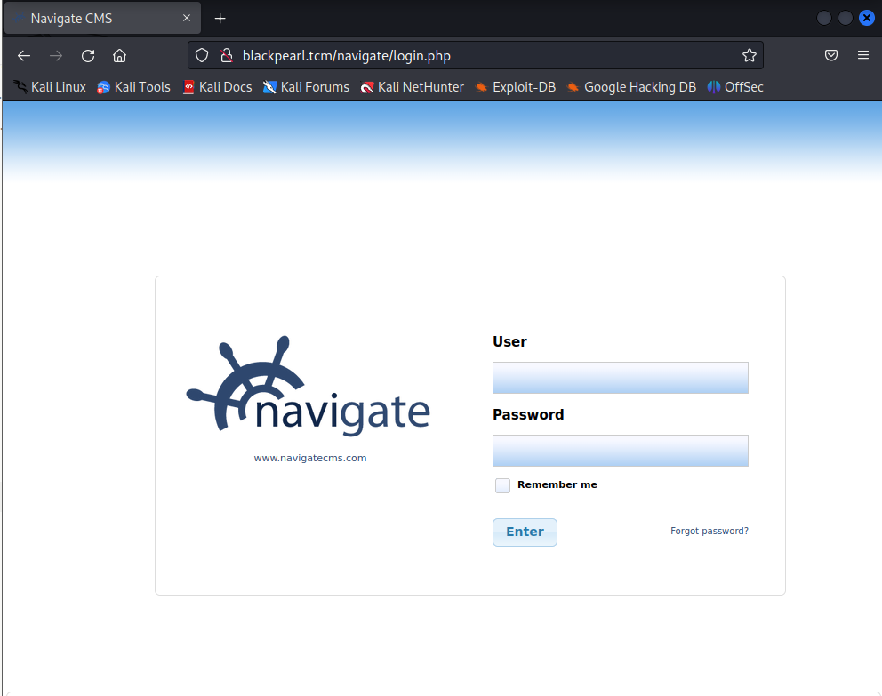

then I run dirb to find directories and found **/secret**

and I visited it and downloaded a text file:

!!!!!!!!!!!!!!!!!!!!!!!!!!!!what!!!!!!!!!!!!!!

then of course port 53 is open for dns for a reason

  

I edited “192.168.133.137 blackpearl.tcm”

then I reload firefox with “blackpearl.tcm” and this page showed up

I ran ffuf one more time but on blackpearl.tcm this time

so we must privilege escalate this shell

with the use of linpeas:

with the use of gtfoopens.com:

finished#######################################