First I run nmap:

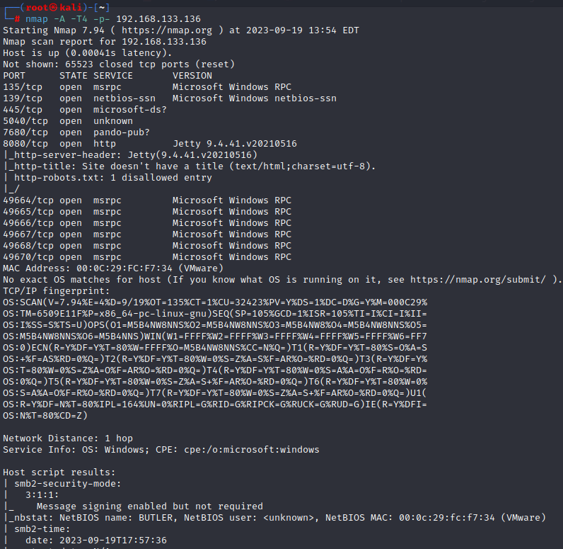

I got port 8080 is open and hosting a login page for JENKINS

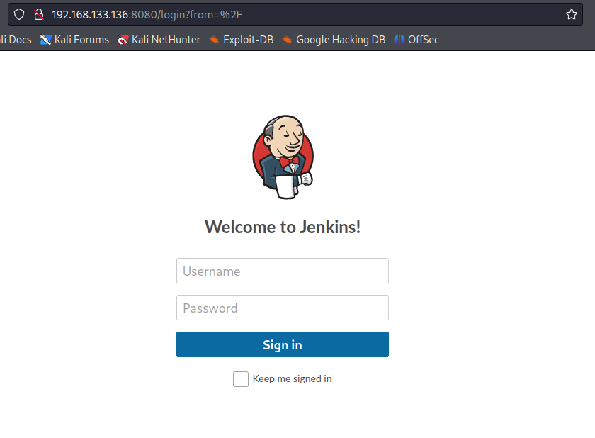

then I enumerated a lot and got nothing so I got lucky when I searched for jenkins default password: **admin/password**

bur it does not work unfortunately

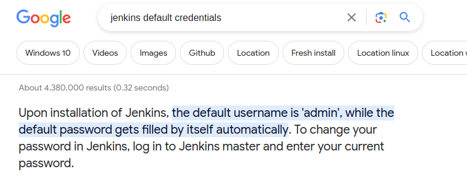

---

so I tried burpsuite

I enabled foxyproxy and then I tried to log in to jenkins again with **admin/password** I know it will not work

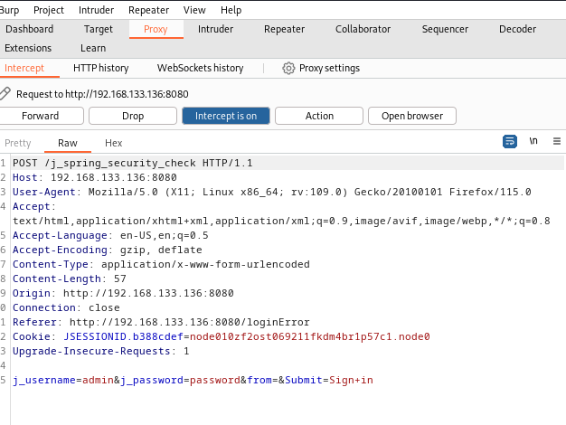

I sent the above to intruder and repeater

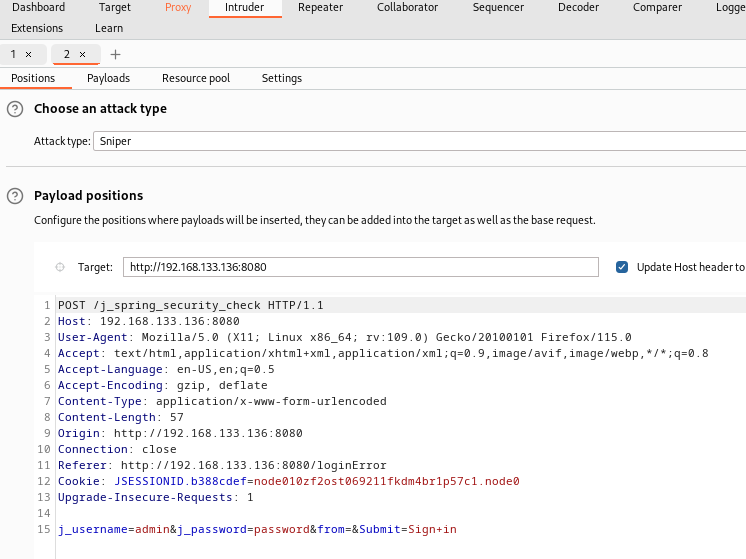

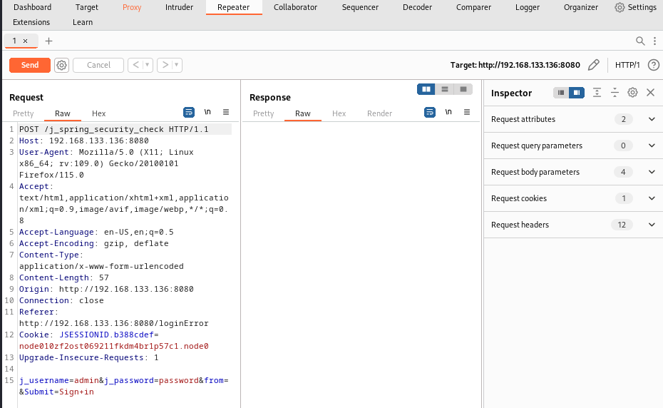

I tried brute force attack on it and found a login credentials: **jenkins/jenkins** and I got in!!!!!!!!!

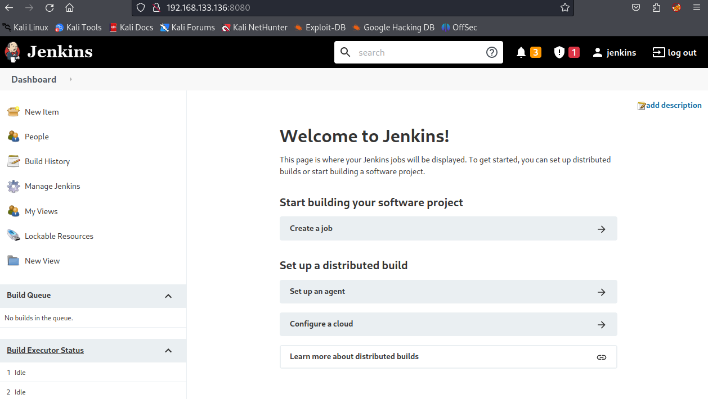

and in manage Jenkins there is a script console in groovy

so I searched for reverse shell in groovy and implemented this reverse shell:

[https://gist.github.com/frohoff/fed1ffaab9b9beeb1c76](https://gist.github.com/frohoff/fed1ffaab9b9beeb1c76)

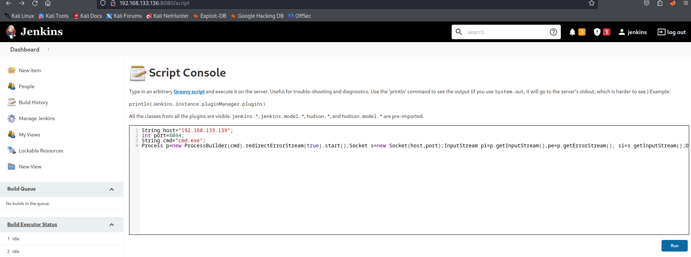

and I run the script while I was setting up a netcat listener

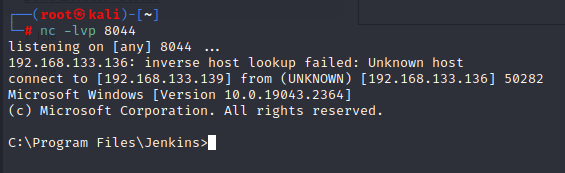

and I got a shell!!!!!!!

and I moved **winpeas** to the machine and run it!!!!!!!!!!!!

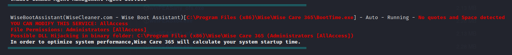

then I created a malware with msfvenom and transfered the file to the butler machine

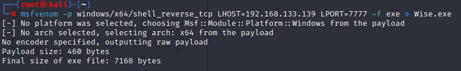

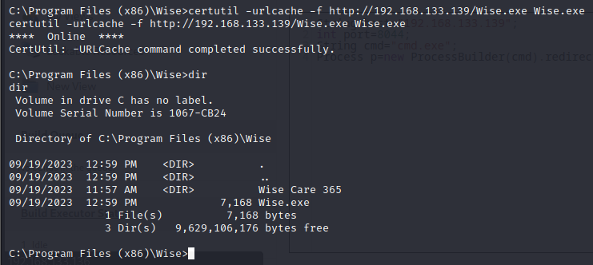

see!!!!!!

so first I stopped the service running

```Lua
 sc query WiseBootAssistant
```

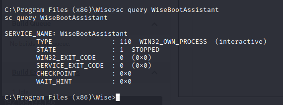

```Lua
sc start WiseBootAssistant
```

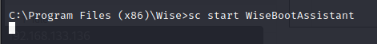

and I got a shell with root!!!!!!!!!!!!!!

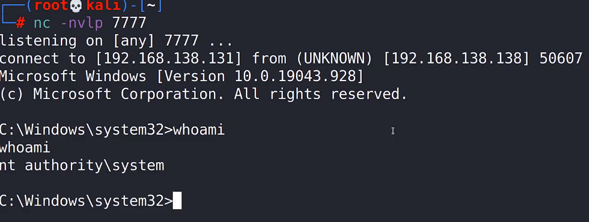