First I run nmap scan and found that robots.txt on port 80

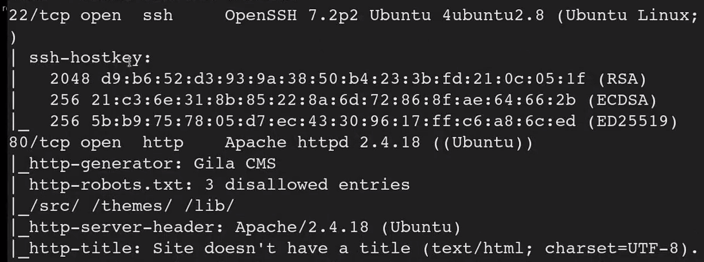

After setting the ip tryhackme gave to me in cmess.thm in /etc/hosts, this is the site

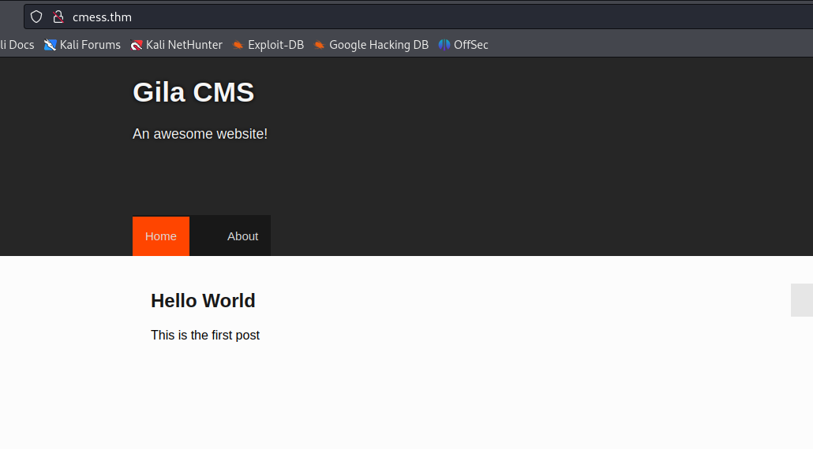

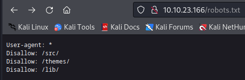

but nothing in these files are useful

then I tried **subdomain enumeration**

```Lua
wfuzz -c -f sub-fighter -w /home/kali/Downloads/subdomains-top1million-5000.txt -u 'http://cmess.thm' -H "HOST: FUZZ.cmess.thm"
```

I run the above first but the output was a plenty but I saw 200 word file called **dev** so I wanted to make sure the I typed this command

```Lua
wfuzz -c -f sub-fighter -w /home/kali/Downloads/subdomains-top1million-5000.txt -u 'http://cmess.thm' -H "HOST: FUZZ.cmess.thm" -hw 290
```

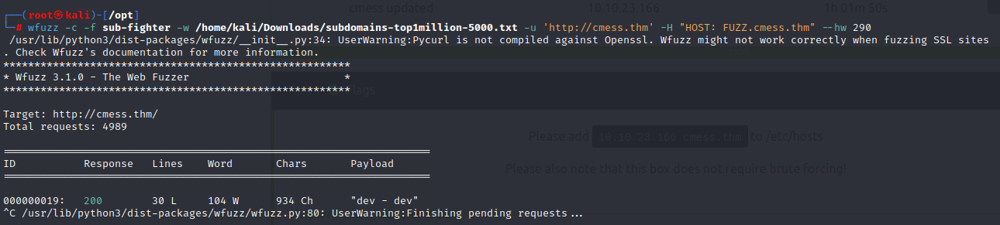

then I visited **dev.cmess.thm**

and found a chat!!! between support and andre and found a password!!!!

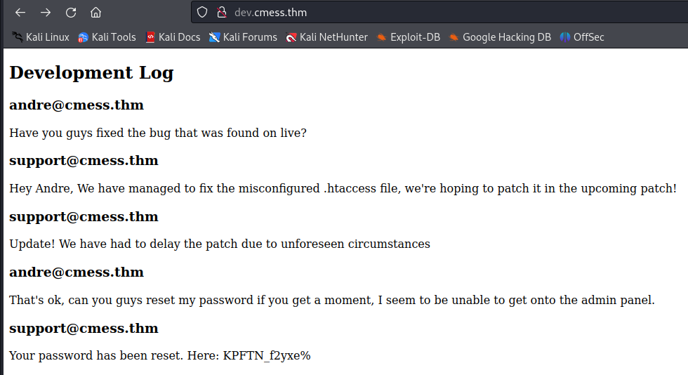

I used the password with the login page I found cmess.thm/admin with these credentials

andre@cmess.thm

KPFTN_f2yxe%

and actually I logged in!!!!

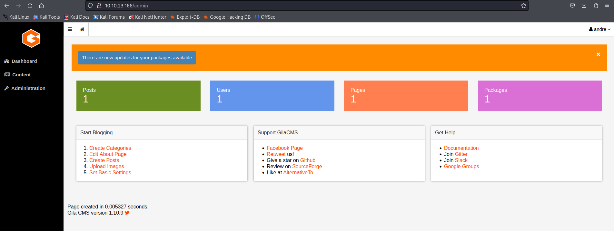

then I tried to find any sort of upload file method on the site to upload a reverse shell and I found it in **content>file manager**

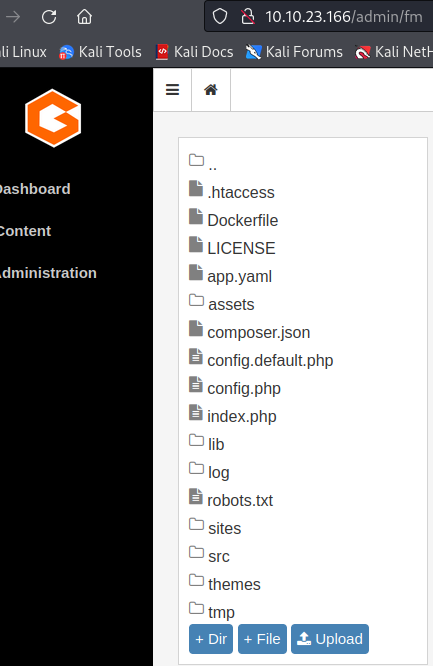

and i uploaded the reverse shell but I downloaded it first from

[https://github.com/pentestmonkey/php-reverse-shell/blob/master/php-reverse-shell.php](https://github.com/pentestmonkey/php-reverse-shell/blob/master/php-reverse-shell.php)

**and changed the ip to my tun ip and the port to 9999**

then I searched where the file has gone to and found it in assets folder

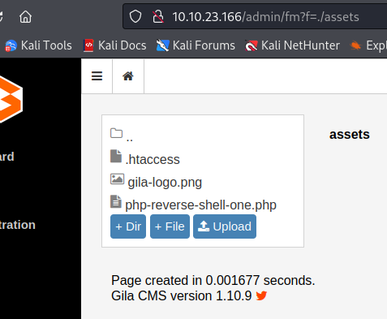

I visited the url containing the file:

[http://cmess.thm/php-reverse-shell-one.php](http://cmess.thm/php-reverse-shell-one.php)

at the same time I sat a listener on my machine

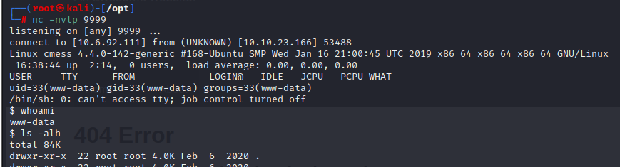

and gained shell

and found a password!!!

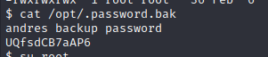

and with it I logged in with ssh with this password I found and username andre I found before

and found the first flag!!!

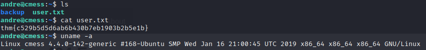

and found a bug in the crontab!!!

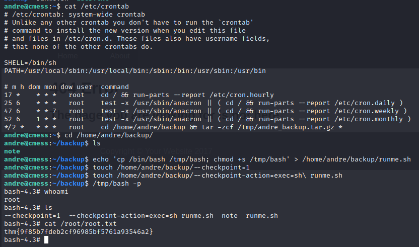

then we got roooooooooot!!!