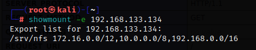
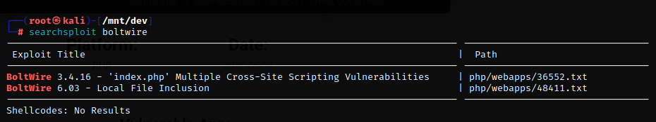
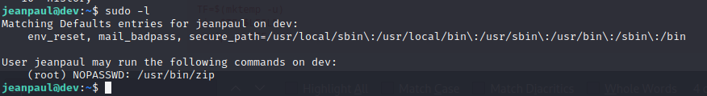

---


```Lua
#~ffuf -w /usr/share/wordlists/dirbuster/directory-list-2.3-medium.txt:FUZZ -u http://192.168.133.134/FUZZ
```

```Lua
#~ffuf -w /usr/share/wordlists/dirbuster/directory-list-2.3-medium.txt:FUZZ -u http://192.168.133.134:8080/FUZZ
```

---







with password of I_love_java it logged in this time


then I run sudo -l



and I searched for zip in gtfobins


and I got root!!!!!!!!!!!!!!!!!!!!!!!!