First I done nmap scan

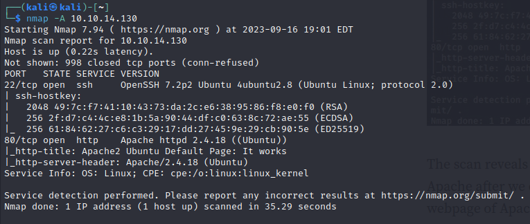

on port 80 I found the default web page of apache

then I run **dirbuster to seek for the directories**

and got directory called content:

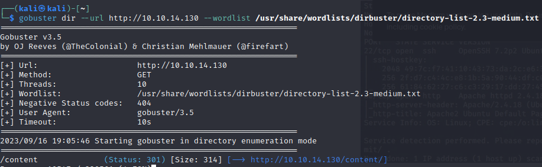

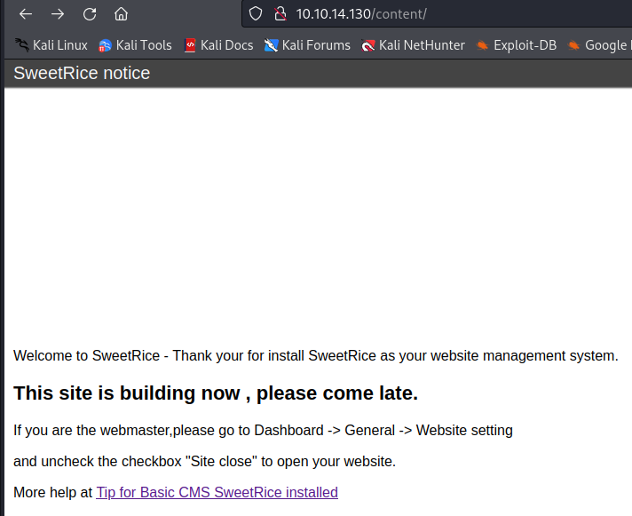

then I run gobuster again on content subdirectory

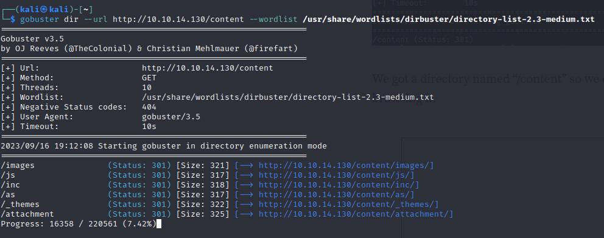

and found a login page!!! in /as but I did not have the credential

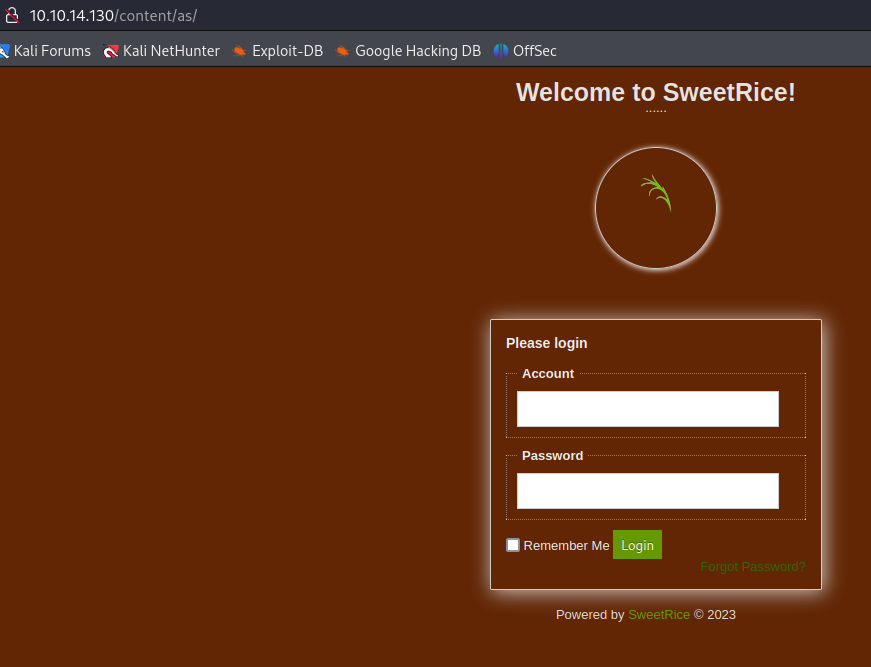

so I checked /inc and found a backup folder with sql

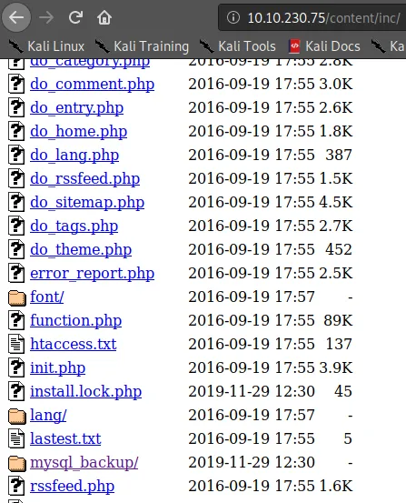

I cat out the content and found a username and hash

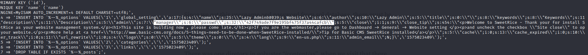

then I cracked this hash

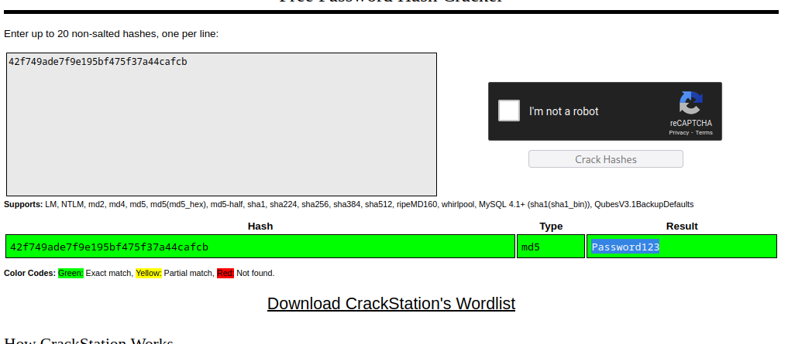

then I logged in with:

manager:password123

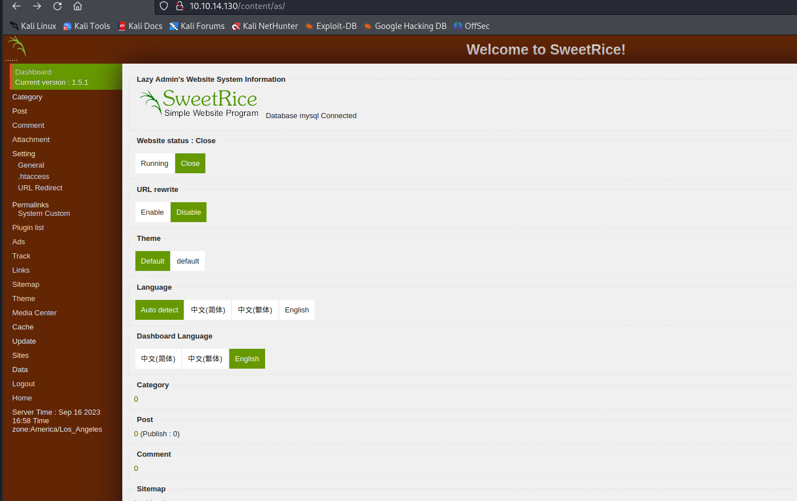

then I switched the first box to running as said in /content

then I refreshed the /content page and:

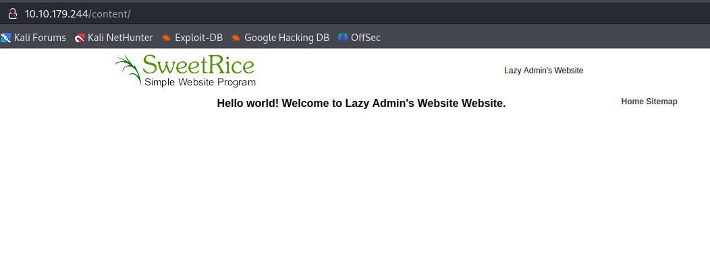

in the ADS section I found this:

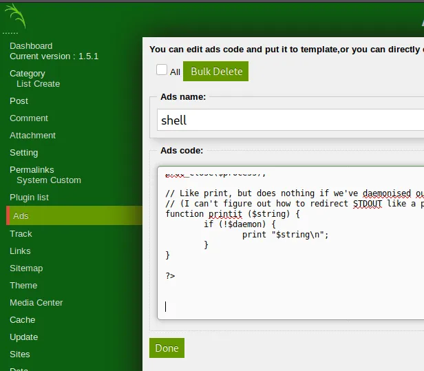

and uploaded the reverse shell and opened a netcat listener

and the file of the reverse shell is uploaded here:

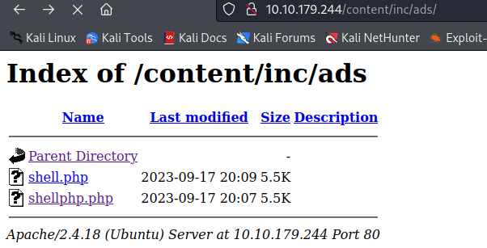

then I got a shell!!!

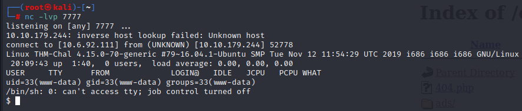