First I did nmap scan

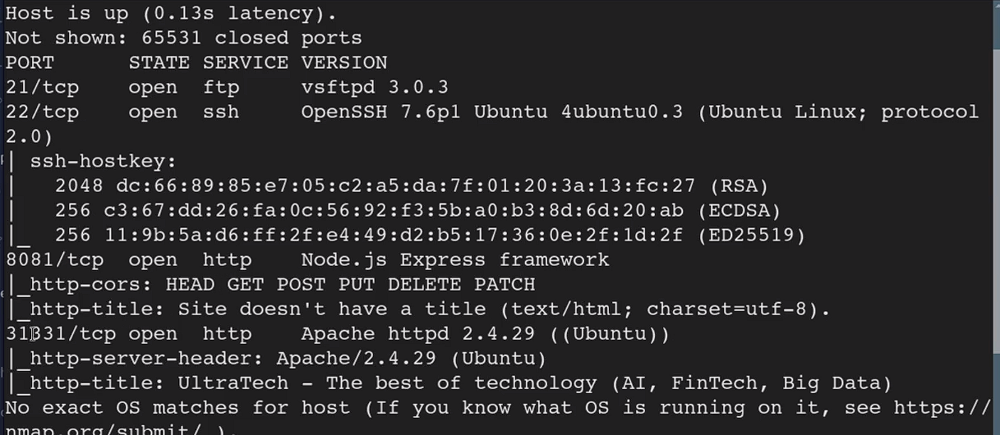

8081

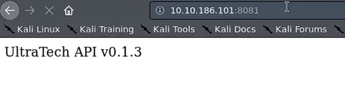

31331

but first I navigated to:

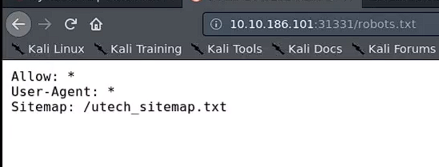

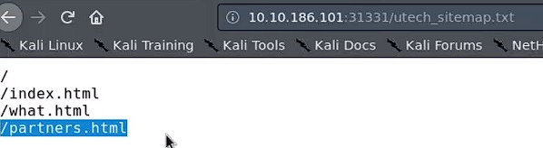

and then I found a login page

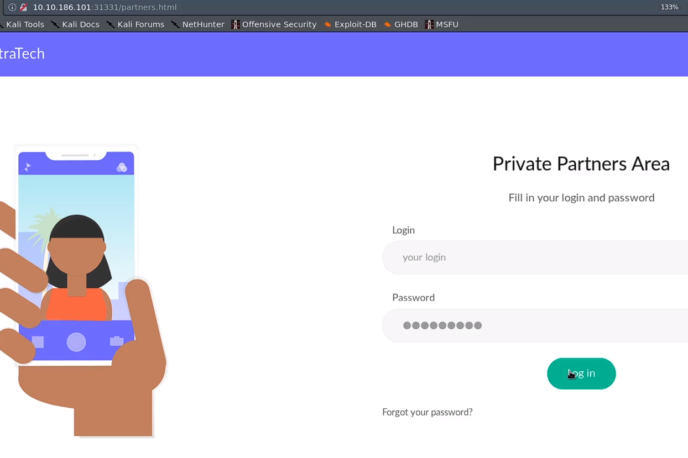

  

i found some files in this site but I used dirb

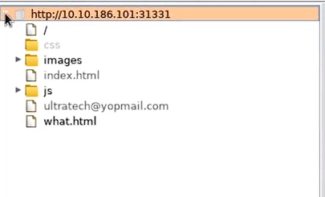

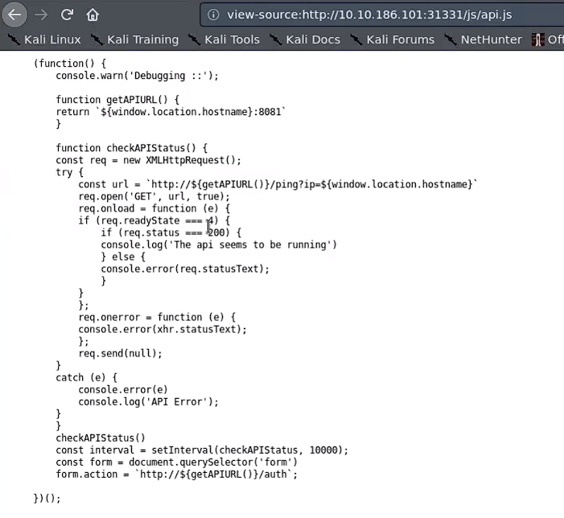

const url = `http://${getAPIURL()}/ping?ip=${window.location.hostname}`

so this code can be edited and do a ping command on hte ip they gave me

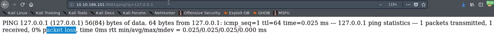

then I edited the command to be OS command injection

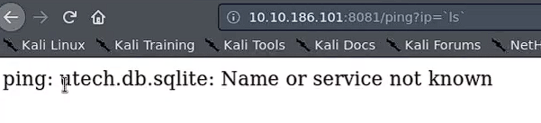

and I found a file!!! and cat it out

and found hashes for r00t and admin users:

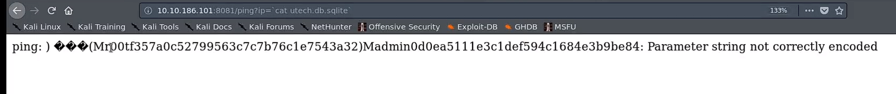

and I cracked the hashes with crackstation.net

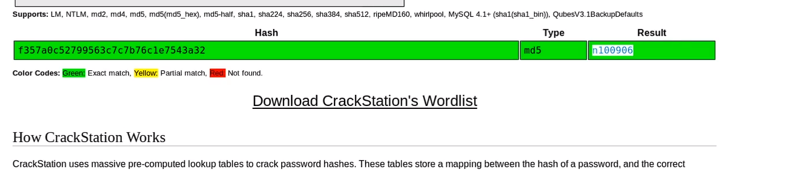

then I tried to connect via ssh with the credentials i found and it worked and got a shell!!!

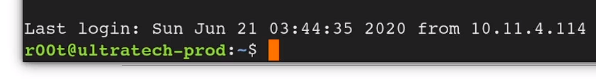

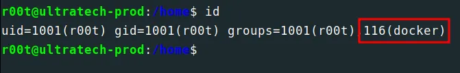

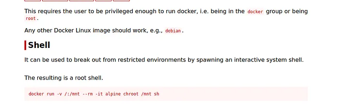

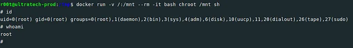

and I got root!