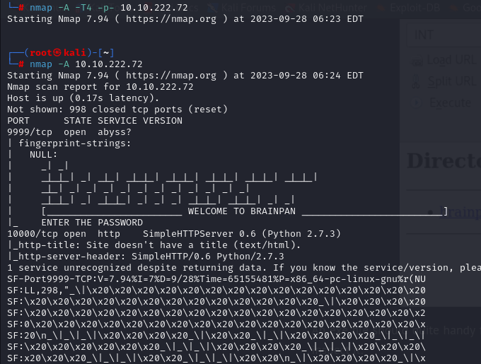
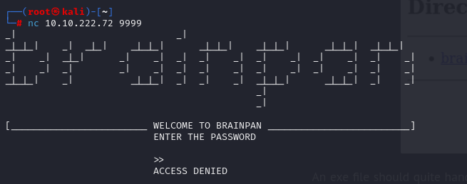
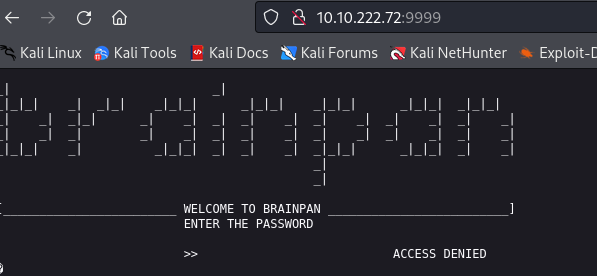
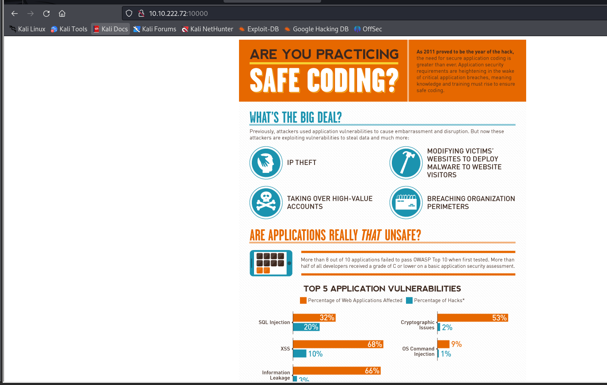
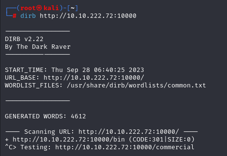
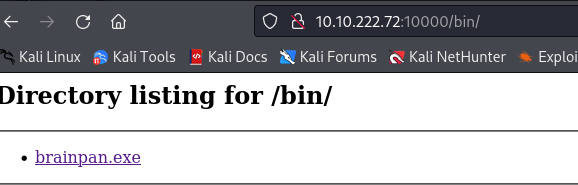

First I run nmap:

I set up a listener on port 9999 to that IP:

and opened it on a browser:

and on port 10000 I found this page:

I run dirb on it:

I found a **/bin** subdirectory:

I downloaded the file and transferred it to my windows machine to debug it on immunity debugger