First I run nmap

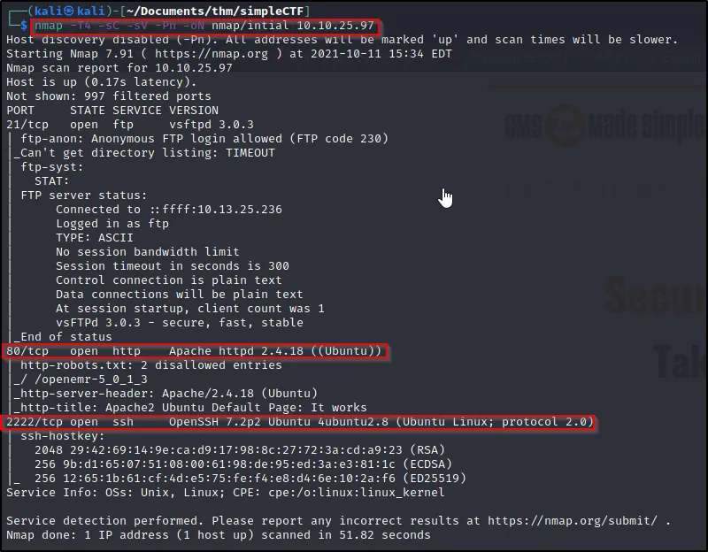

First, let’s just browse to the IP and see what we get.

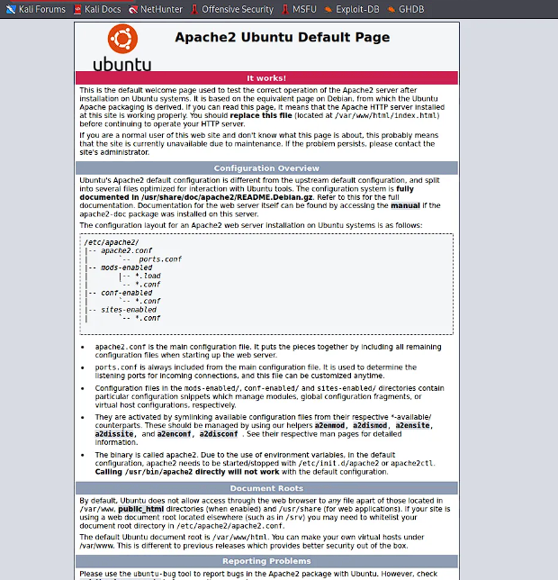

Next, we can use **gobuster** to scan the website for any additional pages.

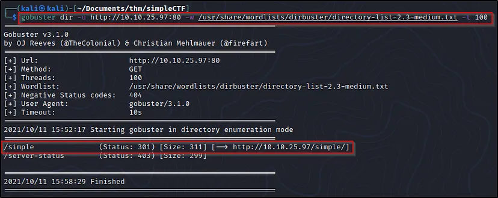

gobuster was able to find there is a webpage at “/simple”. Let’s try browsing to it now and see what we find.

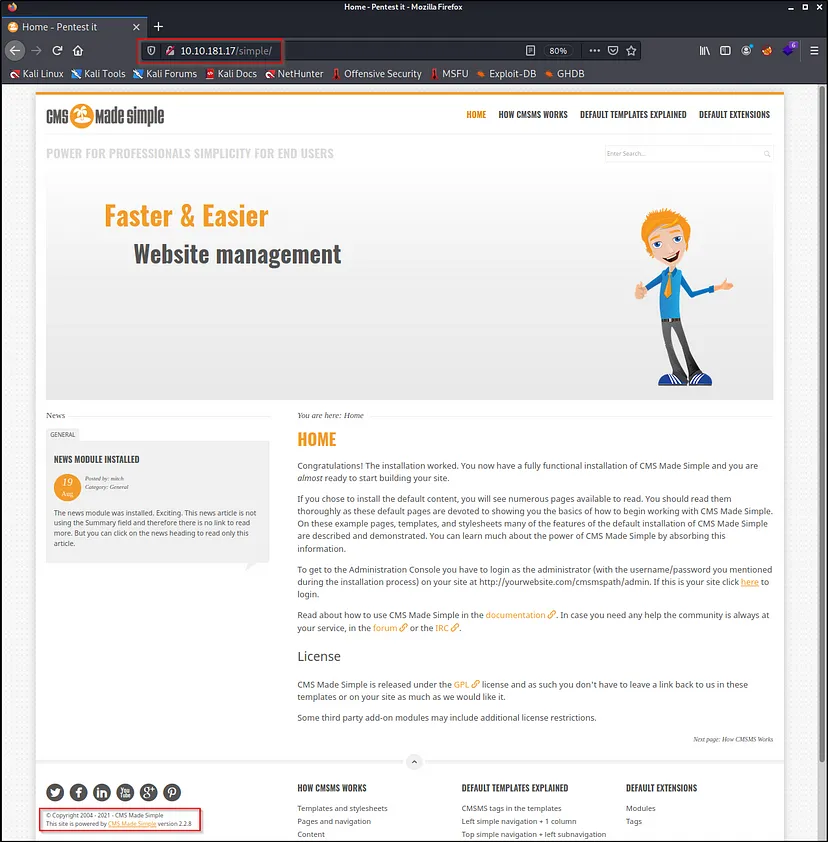

The exploit is a python script so I copied and pasted into a .py document

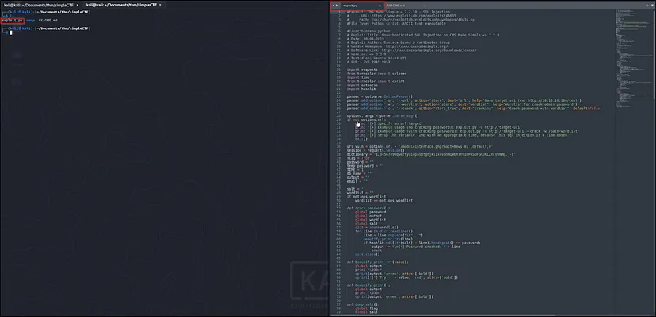

Now let’s try to run it and see what we get in return

Here we can see we need to supply a URL using the -u flag and can supply a wordlist for password cracking using — crack -w

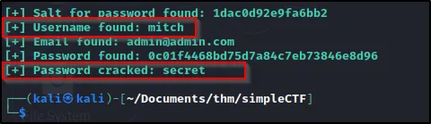

Using the username and password we discovered we can now try to SSH into the target machine

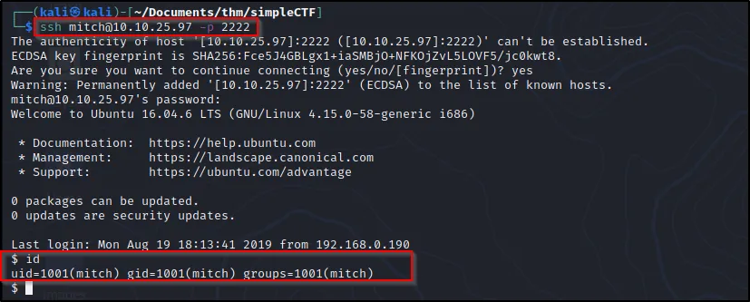

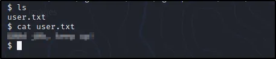

Next let’s check if any other users have home directories.

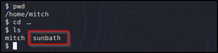

---

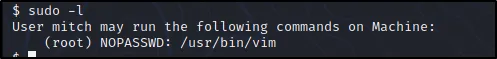

With that information, let’s check out GTFOBins and see if we can use that for privesc.

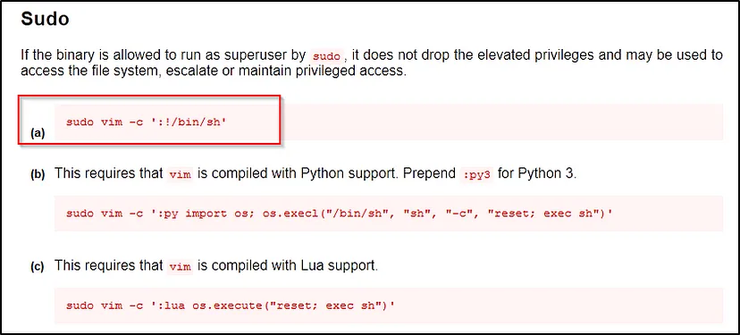

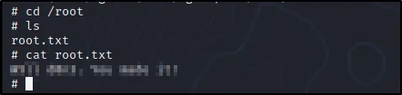