First I run nmap scan:

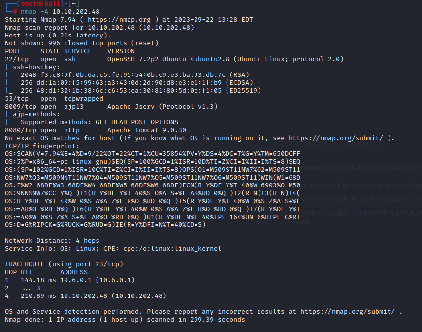

so I searched for **apache jserv (protocol v1.3) exploit** because it seems interesting

so I found exploit: [https://www.exploit-db.com/exploits/48143](https://www.exploit-db.com/exploits/48143)

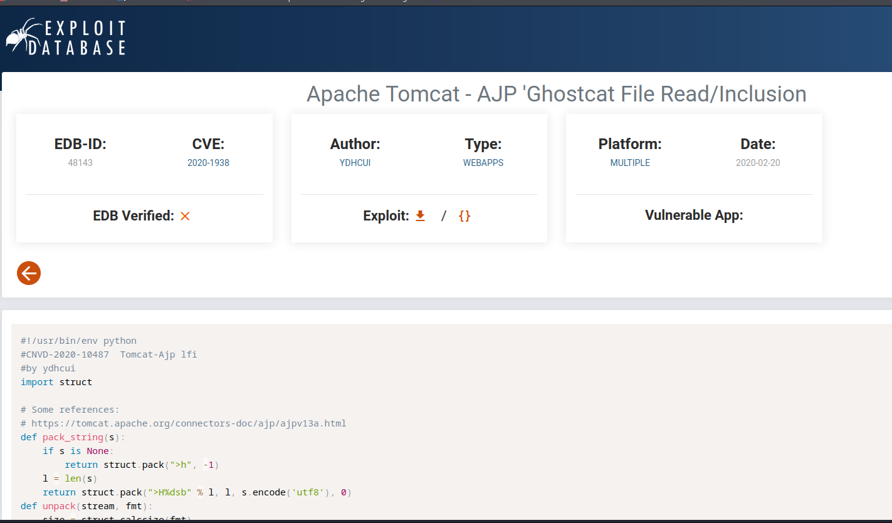

I download it and run it:

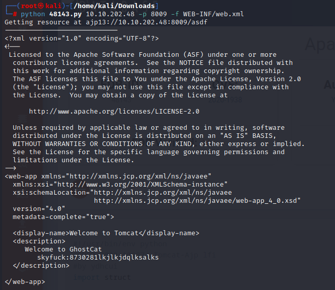

and found a **username and a password!!!!** so I logged in with them and I got a shell!!!:

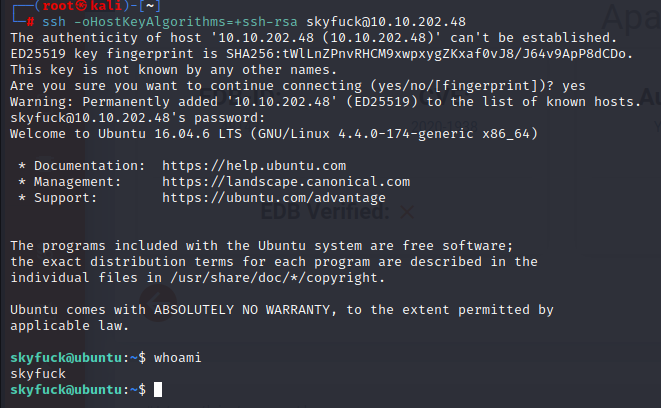

I run history:

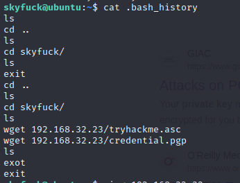

I found these two files:

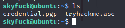

then I transferred them to my machine:

then I searched how to crack **.asc** file:

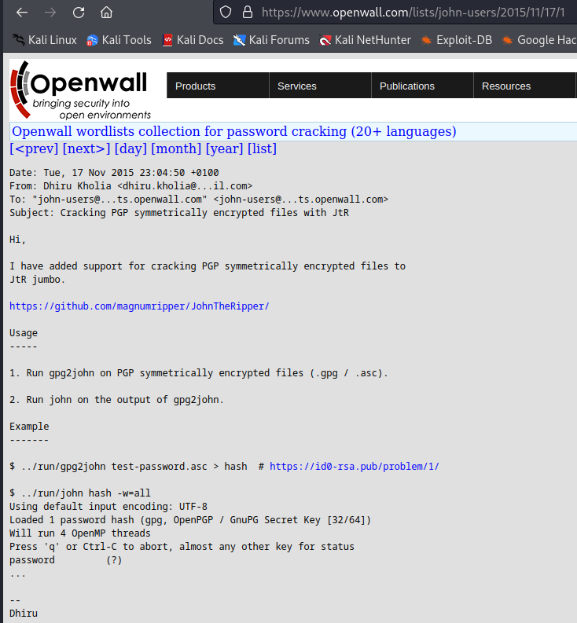

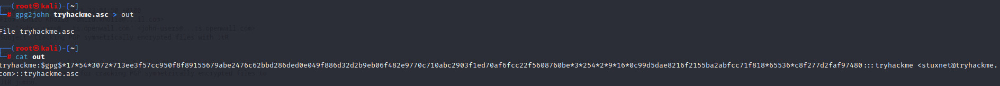

then I cracked the hash that came out:

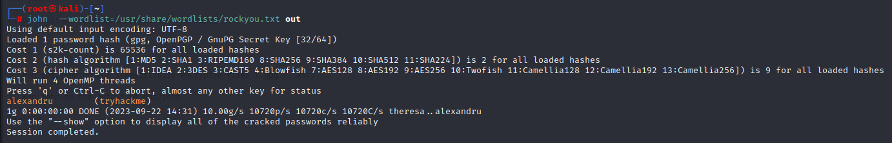

**alexandru is the password to crack the .pgp file:**

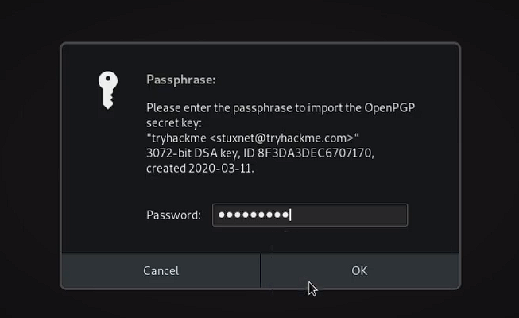

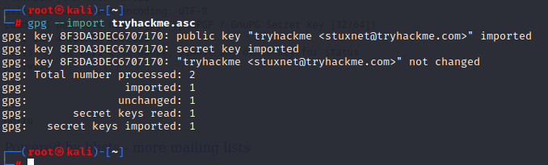

and I can decrypt it now:

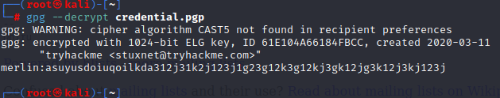

and I got this long password for merlin then I tried to ssh with these credentials and I got a shell of merlin:

then i found a vulnerability:

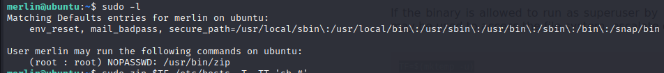

on gtfobins:

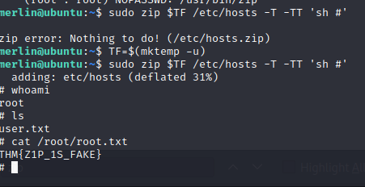

and I got root!!!!!!!