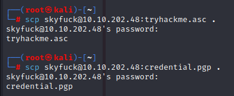
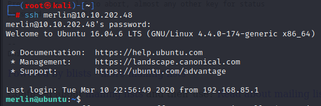
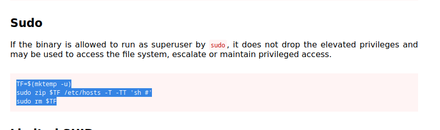

First I run nmap scan:

so I searched for **apache jserv (protocol v1.3) exploit** because it seems interesting

so I found exploit: [https://www.exploit-db.com/exploits/48143](https://www.exploit-db.com/exploits/48143)

I download it and run it:

and found a **username and a password!!!!** so I logged in with them and I got a shell!!!:

I run history:

I found these two files:

then I transferred them to my machine:

then I searched how to crack **.asc** file:

then I cracked the hash that came out:

**alexandru is the password to crack the .pgp file:**

and I can decrypt it now:

and I got this long password for merlin then I tried to ssh with these credentials and I got a shell of merlin:

then i found a vulnerability:

on gtfobins:

and I got root!!!!!!!